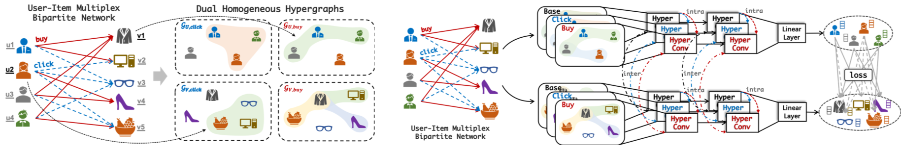

# DualHGCN

This is the source code for The Web Conference (formerly WWW) 2021 paper "[Multiplex Bipartite Network Embedding using Dual Hypergraph Convolutional Networks](https://arxiv.org/abs/2102.06371)".

## Overview

The unsupervised **Dual** **H**yper**G**raph **C**onvolutional **N**etwork (**DualHGCN**) model that scalably transforms the multiplex bipartite network into two sets of homogeneous hypergraphs (left figure) and uses spectral hypergraph convolutional operators, along with intra- and inter-message passing strategies to promote information exchange within and across domains, to learn effective node embeddings (right figure).

## Requirement
```
Python 3.6
networkx == 1.11
numpy == 1.18
sklearn == 0.22
pytorch == 1.3.1
```

## Example Usage
To reproduce the experiments on DTI dataset, simply run:
```
python3 train.py
```

## Reference
All readers are welcome to star/fork this repository and use it to reproduce our experiments or train your own data. Please kindly cite our paper:
```
@inproceedings{Xue2021DualHGCN,
  title     = {Multiplex Bipartite Network Embedding using Dual Hypergraph Convolutional Networks},
  author    = {Xue, Hansheng and Yang, Luwei and Rajan, Vaibhav and Jiang, Wen and Wei, Yi and Lin, Yu},
  booktitle = {WWW},
  year      = {2021}
}
```